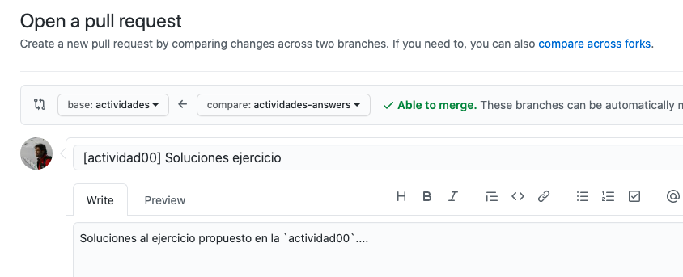
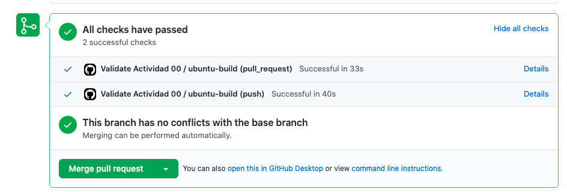

Actividades
-----------

(Documentación en construcción, si necesitas más detalles... pregunta)

¡Enhorabuena por interesarte por el modo difícil para la asignatura de **Estructuras de datos
y algoritmos**!. El objetivo principal de este modo no es tanto realizar ejercicios más
complicados como aprender a utilizar otras herramientas y a colaborar en un proyecto
más grande.

En este modo se espera que utilices Git y GitHub para realizar pull-requests con la
solución a los ejercicios. Gracias a algunas GitHub Actions los ejercicios se
corregirán automáticamente (se ejecutarán diferentes tipos de tests) y podrás
iterar la solución hasta que los tests pasen satisfactoriamente.

## pull-request

Existen cientos de páginas web en las que puedes encontrar información sobre cómo 
crear un pull-request ([ejemplo](https://docs.github.com/en/github/collaborating-with-issues-and-pull-requests/creating-a-pull-request-from-a-fork)).

Cuando abras el pull-request pon mucha atención y asegúrate de que la rama de 
destino es la rama `actividades`:

Una vez creado el pull-request el CI se lanzará automáticamente y podrás ver el
resultado de los tests. Trabaja en ellos, arréglalos, haz tantos commits como
necesites hasta que consigas que todos los tests pasen en verde:

