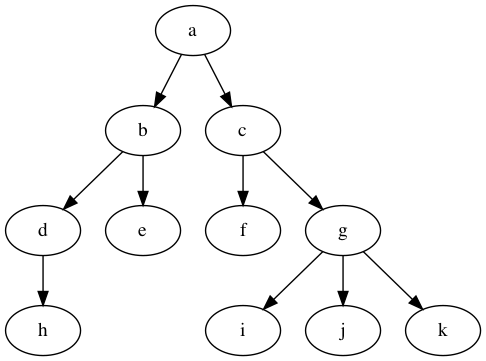
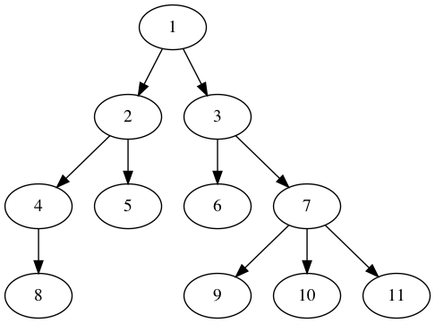
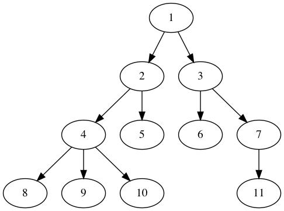
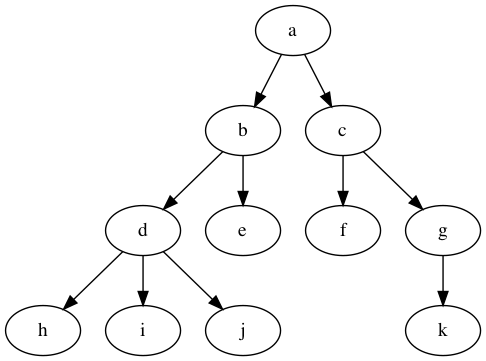

Exámen parcial
==============

Pregunta
--------

Implementar una función que inserte un nodo en una posición determinada de una lista simplemente enlazada. Dicha función devolverá `true` si ha podido realizar la inserción o `false` si no ha podido hacerlo (porque la lista no era lo suficientemente larga como para poder insertarlo en esa posición). 

Los nodos de la lista son instancias de la siguiente clase:

```cpp
class ElementListaSimple {
    public :
        TipoDato dato;
        std::shared_ptr<ElementListaSimple>  next = nullptr ;

    public :
        ElementListaSimple( const TipoDato& dato_) : dato{dato_} {};
};
```


El prototipo de la función a implementar es el siguiente:

```cpp
bool insert(std::shared_ptr<ElementListaSimple>& front,
                    const TipoDato& dato,
                    int position) {
      // TODO: Implement here
}
```

donde los argumentos tienen el siguiente significado:

 * `front`: puntero al primer elemento de la lista (en caso de que la lista esté vacía su valor es `nullptr`)
 * `dato`: el dato a insertar
 * `position`: posición en la que debe insertarse el dato (la posición 0 se corresponde con el primer elemento de la lista)


Pregunta
--------

Implementar el método de ordenación de la burbuja para un vector de floats:

```cpp
void bubble_sort(std::vector<float>& desordenado) {
    // TODO: Implement here
}
```


Pregunta
--------

Se dispone de una clase Queue en C++ que implementa la funcionalidad de una cola que almacena números enteros (`int`). Esta clase tiene la siguiente interfaz:

```cpp
class Queue {
    public:
        Queue();

        int size() const;
        bool empty() const;

        int front() const;
        int back() const;

        void push(const int& dato);
        void pop();
};
```


Debe implementarse una función que saque los elementos pares de la cola y los devuelva en otra cola en el mismo orden en que estuvieran:

```cpp
Queue extraer_elementos_pares(Queue input) {
    // TODO: Implement here
}
```


Nota.- Sólo debe implementarse la función `extraer_elementos_pares`, los métodos de la clase `Queue` no hay que implementarlos.


Pregunta
--------

El siguiente programa implementa el conocido como cifrado César de forma iterativa. El cifrado César lo único que hacer es sustituir cada letra de una cadena por otra, en concreto por la letra que se encuentra desplazada `x` posiciones en la clave:

```cpp
#include < iostream >
#include < string >

const std::string key = "abcdefghijklmnopqrstuvwxyz" ;

std::string cipher_iterative(std::string str, int i) {
    std::string output;
        for ( char ch: str) {
        ch = ( char ) (key.at( 0 ) + (ch - key.at( 0 ) + i) % key.size());
        output.push_back(ch);
        }
        return output;
}


int main() {
    std::string input = "estructurasdedatos" ;
        int shift = 1 ;
    std::cout << input << std::endl;

    std::cout << cipher_iterative(input, shift) << std::endl;
    // std::cout << cipher_recursive(input, shift) << std::endl;
}
```


Se pide implementar el algoritmo de forma recursiva:

```cpp
std::string cipher_recursive(std::string str, int i) {
    // TODO: Implement here
}
```


Pregunta
--------

Implementar una función recursiva que calcule la suma de los elementos de un vector:

```cpp
#include <iostream>
#include <vector>

float accumulate( float sum, std::vector< float > values) {
    // TODO: Implement here
}


int main() {
    std::vector< float > values{ 2 , 3 , 5 , 8 };
    std::cout << accumulate( 0 , values) << std::endl;
}
```


Pregunta
--------

A partir del árbol indicado en la imagen, indicar el orden en el que se visitan los nodos para los siguientes recorridos:

 * Recorrido en profundidad pre-orden (DFS pre-order)
 * Recorrido en profundidad in-orden (DFS in-order)
 * Recorrido en profundidad post-orden (DFS post-order)
 * Recorrido en anchura (BFS)

Árbol 1:



Árbol 2:



Árbol 3:



Árbol 4:


